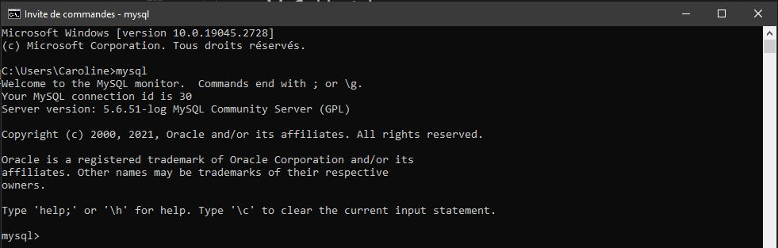
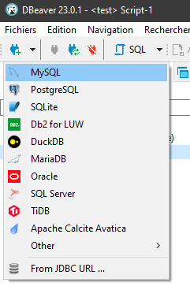
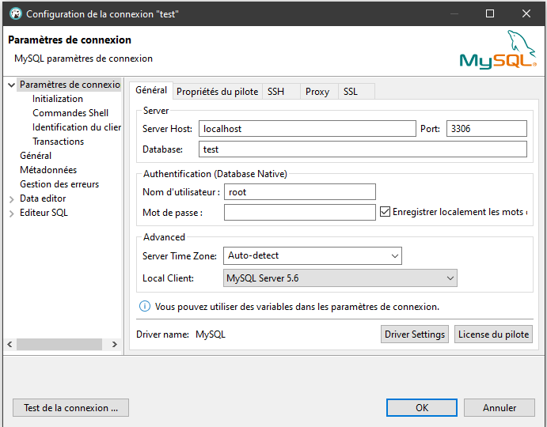
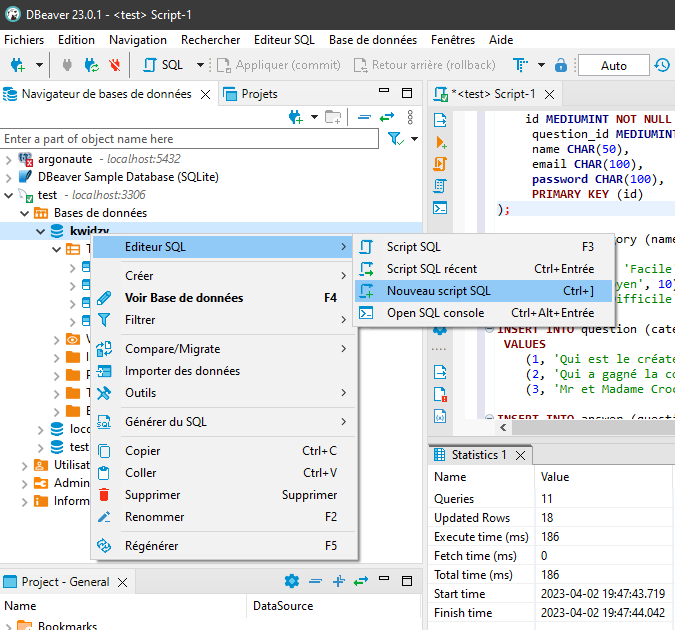
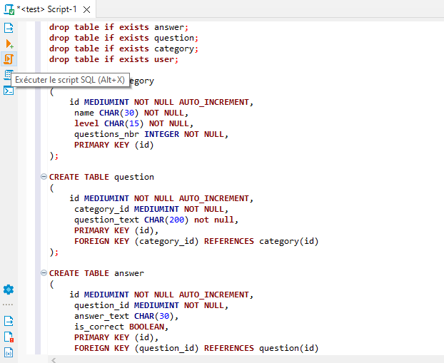

# **Kwidzy - Back**
*Dbeaver, MySQL, Node, Restify*
--

## 👶 **Getting Started**

First, run the development server (back folder):

```bash
npm start | node main.js
```
Open [http://localhost:3030](http://localhost:3030) with your browser to see the result. 

## 🔧 **Setup project**

```bash
npm install
```

### main.js
Point d'entrée du backend, c'est ce fichier qu'il faut lancer en premier lorsque le back démarre.  
Il fait l'initialisation de la connection à la base MySql (en faisant un require sur les routes, et les routes font un require sur le fichier qui fait des requêtes sur la base, et ce fichier fait l'initialisation de la connection lui même).
Il fait l'initialisation des routes avec le require sur routes.js.  
Il lance le server avec ser.listen sur le port 3030.  
Restify : Librairie qui permet de faire un serveur REST. Ressemble à Express.

### routes.js
Définit les routes de l'api REST,  
"/" pour le moment, mais il est possible d'en ajouter d'autres.

# Comment récupérer la base de donnée sur un autre pc ? Process:
## MySql instal
- Installer MySql -> https://dev.mysql.com/downloads/installer/
- appuyer sur "windows" -> cmd
- taper "mysql -u root -p" puis entrer
- normalement, tu dois avoir ça :

- Si jamais il te demande de mettre un mot de passe, retiens le bien et utilises le plus tard quand tu dois mettre un mdp qqpart.
- Une fois que tu as ça dans le terminal, écrit ça puis entrer :
```sql
CREATE DATABASE kwidzy;
```

## 2 Dbeaver
- Télécharger dbeaver -> https://dbeaver.io/download/
- Sur dbeaver, cliquer sur MySql
- Si jamais il demande de télécharger un driver, tu dis OUIIIIII

- Puis mettre les configs suivantes (kwidzy à la place de test)

- Si tout va bien jusqu'ici GG !
- Faire un nouveau script :

- Dans la truc du script, copier coller tout le tas de script SQL qu'on a mis en dessous, puis l'executer avec le 3em bouton à gauche :


## **SQL Creation**

```bash
drop table if exists answer;
drop table if exists question;
drop table if exists category;
drop table if exists user;

CREATE TABLE category
(
    id MEDIUMINT NOT NULL AUTO_INCREMENT,
     name CHAR(30) NOT NULL,
     level CHAR(15) NOT NULL,
     questions_nbr INTEGER NOT NULL,
     PRIMARY KEY (id)
);

CREATE TABLE question
(
    id MEDIUMINT NOT NULL AUTO_INCREMENT,
     category_id MEDIUMINT NOT NULL,
     question_text CHAR(200) not null,
     PRIMARY KEY (id),
     FOREIGN KEY (category_id) REFERENCES category(id)
);

CREATE TABLE answer
(
    id MEDIUMINT NOT NULL AUTO_INCREMENT,
     question_id MEDIUMINT NOT NULL,
     answer_text CHAR(30),
     is_correct BOOLEAN,
     PRIMARY KEY (id),
     FOREIGN KEY (question_id) REFERENCES question(id)
);

CREATE TABLE user
(
    id MEDIUMINT NOT NULL AUTO_INCREMENT,
     question_id MEDIUMINT NOT NULL,
     name CHAR(50),
     email CHAR(100),
     password CHAR(100),
     PRIMARY KEY (id)
);

INSERT INTO category (name, level, questions_nbr)
 VALUES
    ('Numérique', 'Facile', 10),
    ('Sport', 'Moyen', 10),
    ('Humour', 'Difficile', 15);

INSERT INTO question (category_id, question_text )
 VALUES
    (1, 'Qui est le créateur de Facebook ?'),
    (2, 'Qui a gagné la coupe du monde en 2018 ?'),
    (3, 'Mr et Madame Croche ont une fille, comment sappelle t\'elle ?');

INSERT INTO answer (question_id, answer_text, is_correct)
 values
 #Q1
 (1, 'Pas lui', false),
 (1, 'Lui', true),
 (1, 'Pas lui', false),
 (1, 'Pas lui', false),
 #Q2
 (2, 'Allemagne', false),
 (2, 'Portugal', false),
 (2, 'Espagne', false),
 (2, 'France', true),
 #Q3
 (3, 'Sarah', true),
 (3, 'Caroline', false),
 (3, 'Thomas', false),
 (3, 'La réponse D', true);
```

### Docs
- https://www.w3schools.com/nodejs/nodejs_mysql.asp
- http://restify.com/docs/home/